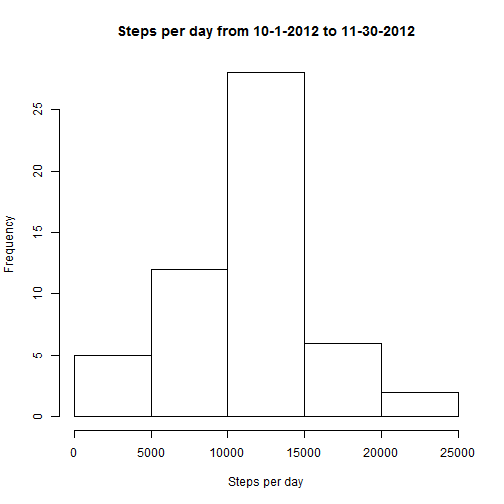
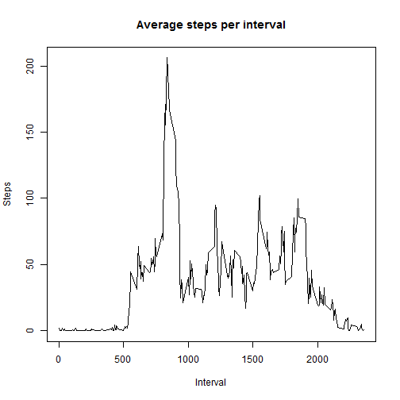
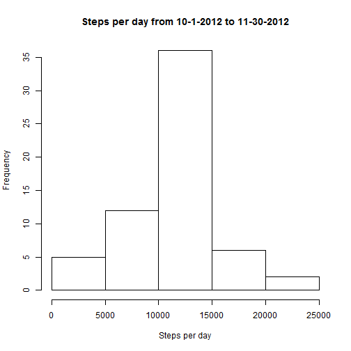
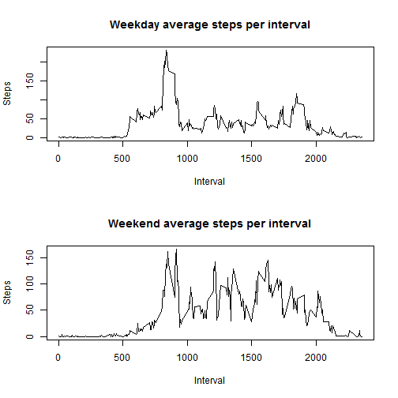

# Reproducible Research: Peer Assessment 1
## Loading and preprocessing the data

The following code loads the activity data and strips out the NAs.


```r
activityRaw <- read.csv("activity.csv")
activity <- activityRaw[complete.cases(activityRaw),]
```

## What is mean total number of steps taken per day?


```r
stepsPerDay <- tapply(activity$steps, activity$date, sum)
hist(stepsPerDay, main = "Steps per day from 10-1-2012 to 11-30-2012", xlab = "Steps per day")
```

 

```r
meanSteps <- mean(stepsPerDay, na.rm = TRUE)
medianSteps <- median(stepsPerDay, na.rm = TRUE)
```

The mean number of steps taken per day is 10766. 
The median number of steps taken per day is 10765. 

## What is the average daily activity pattern?


```r
stepsPerInterval <- tapply(activity$steps, activity$interval, mean)
plot(names(stepsPerInterval), stepsPerInterval, type="l", main = "Average steps per interval", ylab = "Steps", xlab = "Interval")
```

 

```r
maxInterval <- names(which.max(stepsPerInterval))
```

The 5-minute interval with the maximum average number of steps is 835.


## Imputing missing values

```r
activityNew <- activityRaw
allNAs <- which(is.na(activityNew$steps))
```
The total number of missing values in the dataset is 2304.  We will fill in missing values using the mean of that 5-minute interval over all the other days.


```r
for(i in allNAs)
{
    activityNew$steps[i] <- stepsPerInterval[((i-1) %% length(stepsPerInterval)) + 1]
}

stepsPerDayNew <- tapply(activityNew$steps, activityNew$date, sum)
hist(stepsPerDayNew, main = "Steps per day from 10-1-2012 to 11-30-2012", xlab = "Steps per day")
```

 

Comparing this plot to the previous one, we see that the middle bar (the one that contains the mean value) now has a higher value than it did before, whereas all other bars have the same value as before.  


```r
meanStepsNew <- mean(stepsPerDayNew)
medianStepsNew <- median(stepsPerDayNew)
```

Using this strategy to fill in missing values, the mean number of steps taken per day is 10766.  This value is the same as before because taking a set of numbers and adding the mean value one or more times to it does not change the mean of the new set.
Using this strategy to fill in missing values, the median number of steps taken per day is 10766.  This value is slightly higher than it was before we filled in missing values.

## Are there differences in activity patterns between weekdays and weekends?
The following code adds a new column to the data set that represents whether that particular observation was taken on a weekday or a weekend.  It then draws 2 plots - one that shows the average steps per interval for weekdays, and the other shows average steps per interval for weekends.


```r
daysOfWeek <- weekdays(as.Date(activityNew$date))
dayType <- character()
for(day in daysOfWeek)
{
    if(day == "Saturday" || day == "Sunday")
    {
        dayType <- c(dayType, "weekend")
    }
    else
    {
        dayType <- c(dayType, "weekday")
    }
}

activityNew$dayType <- as.factor(dayType)
par(mfrow = c(2, 1))
outdata <- data.frame(tapply(activityNew$steps, list(activityNew$interval, activityNew$dayType), mean))
plot(row.names(outdata), outdata$weekday, type="l", main="Weekday average steps per interval", ylab = "Steps", xlab = "Interval")
plot(row.names(outdata), outdata$weekend, type="l", main="Weekend average steps per interval", ylab = "Steps", xlab = "Interval")
```

 

